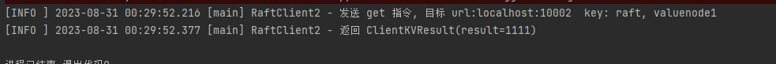

### 理论基础

Raft算法是一种共识算法，旨在解决分布式系统中数据一致性的问题。

Raft 为了算法的可理解性，将算法分成了 4 个部分。

##### leader 选举

集群中的节点通过选举选择一个Leader，Leader负责处理客户端请求和日志复制。

##### 日志复制

Leader负责将客户端请求追加到日志中，并将这些日志复制到其他节点，以确保数据一致性。日志复制可以说是 Raft 核心的核心，说简单点，Raft 就是为了保证多节点之间日志的一致。当日志一致，我们可以认为整个系统的状态是一致的。

Raft leader 节点会将客户端的请求都封装成日志，发送到各个 follower 中，如果集群中超过一半的 follower 回复成功，那么这个日志就可以被提交（commit），这个 commit 可以理解为 事务ACID 中的持久化。

##### 成员变更

成员变更是指向集群中添加或删除节点的过程。这可以是由于系统扩展、故障恢复、维护等原因引起的。

##### 日志压缩

日志压缩是一种优化技术，用于减少存储和传输大量日志数据所需的资源。在Raft算法中，日志是用来记录客户端请求和操作的，但随着时间的推移，日志可能会变得很大。为了减少存储和传输的开销，可以使用日志压缩技术来压缩日志数据。


​	leader 都是必须的，所有的写操作都是由 leader 发起，从而保证数据流向足够简单。而 leader 的选举则通过比较每个节点的逻辑时间（term）大小，以及日志下标（index）的大小。

​	Raft 就是为了保证多节点之间日志的一致。当日志一致，我们可以认为整个系统的状态是一致的。而Raft 通过各种补丁，保证了日志复制的正确性。

​	第三点则是为了节点的扩展性。第四点是为了性能。重要性次于前面两条。


### 实现内容

​	为了检查Raft算法中的选举、同步等操作细节。本实验将实现Raft算法的选举和日志复制两大核心内容，同时基于Raft分布式共识算法实现一个极简的KV-Map内存存储，用于查看日志同步和提交结果。


### 实验思路

#### 技术模块

| 模块          | 功能                                             | 实现方式                                                     |
| ------------- | ------------------------------------------------ | ------------------------------------------------------------ |
| **共识模块 **    | 通过一致性模块，保证 Raft 集群节点数据的一致性。 | 根据论文描述编码实现                                         |
| **日志模块**     | 用于处理每个Raft节点的日志                       | （待优化）在代码内部实现了基于内存的类LRU的双向链表，方便下标检索和尾部添加日志元素。缺点：进程关闭后数据丢失，后续优化为持久化存储。 |
| **状态机模块**   | 可以是任何实现，其实质就是将日志中的内容进行处理。在本实验的KV存储中，状态机模块的实现即根据日志内容完成内存中元素的获取和设置。 | Java-Map实现内存KV内容的存储。只提供GET和SET操作 |
| **RPC通信模块** | 用于Raft个节点之间的IPC通信 | 没有使用其它第三方的RPC框架模块，因为本实验注重模拟和简要测试。实现方法为使用JDK自带工具类基于HTTP协议完成IPC通信。 |


#### 重要接口设计

定义的重点接口或功能有:

##### 共识模块接口

选举投票 以及 附加日志。也就是Raft 节点核心功能

```java
public interface Consensus {

    /**
     * 请求投票 RPC
     * @return
     */
    VoteResult requestVote(VoteRequest voteRequest);

    /**
     * 附加日志 RPC
     * @return
     */
    AppendEntryResult appendEntries(AppendEntryRequest appendEntryRequest);
}
```

##### 日志模块接口

主要是根据Raft日志的增删改查操作的特点设计了以下接口

```java
public interface Log {


    void write(LogEntry logEntry);

    LogEntry read(Long index);

    void removeOnStartIndex(Long startIndex);

    LogEntry getLast();

    Long getLastIndex();
}

```

##### 状态机模块接口

状态机模块接口。在 Raft 论文中将数据保存到状态机，作者称之为应用，就是将已成功提交的日志应用到状态机(KV存储应用)中。

```java
public interface StateMachine {

    void apply(LogEntry logEntry);

    String get(String key);
}

```

第一个 apply 方法，就是 Raft 论文中将日志应用到状态机中的方法。


#### 算法实现描述


##### 选举实现

选举就是一个定时器，超时了就需要重新选举。

实验使用 Java 的定时任务线程池进行实现：

1. 选举者不是 leader。
2. 超出设定时间进行选举。
3. 选举者优先选举自己, 状态变成 candidate。
4. 任期term加1。
5. 向其它已知节点发送请求投票 RPC，参数包括自身的 任期term，自身的 lastIndex，以及日志的 lastTerm。
6. 如果有超过半数节点投票给自己，那么就变成 leader状态 ，并发送leader心跳。
7. 如果失败了，就重新选举。若有其他节点发送心跳，立刻变成 follower状态。


##### 日志复制实现

###### 心跳

心跳实现为定时任务：

1.  leader 状态才能发送心跳。
2. 定时发送心跳RPC请求，心跳参数包括自身的 ID，自身的 term

###### 日志附加

在本实验的实现中，若KV存储的请求客户端发送了查询或设置KV存储的RPC请求，leader需要将操作记录为日志，并完成复制，实现多节点的存储内容同步：

1. 只有 leader 能处理KV请求，所以如果自身不是 leader，则需要转发给 leader。
2. 将用户的 KV 操作封装成日志，包括 term，index，command，预提交本地。
3. 向其他节点发送数据，复制操作的 RPC请求。
4. 过半节点返回成功，那么就提交这条日志。
5. 更新自己的 commitIndex，lastApplied 等信息。

### 实验验证

#### 测试方法

​	本地启动三个raft节点进程, 分别监听10001 10002 10003 三个端口, 并以此作为各自节点id, 通过随机关闭节点和观察输出日志来验证raft算法协调等操作的细节。

#### 选举验证

##### 1.  Raft集群初始化

​	(1) 首先启动第一个节点


```log
[INFO ] 2023-08-30 17:13:26.952 [main] RpcServer - Server is listening on port 10001
[INFO ] 2023-08-30 17:13:26.961 [main] Node - 启动成功, selfId : Peer(address=localhost:10001) 
[INFO ] 2023-08-30 17:13:32.962 [Raft thread] Node - 节点 Peer(address=localhost:10001) 成为候选人   开始leader 选举, current term : [1], LastEntry : [LogEntry(index=1, term=1, command=Command(method=SET, key=raft, value=true))]
[INFO ] 2023-08-30 17:13:32.962 [Raft thread] Node - 成员数量 : 2, 成员列表 : [Peer(address=localhost:10002), Peer(address=localhost:10003)]
[INFO ] 2023-08-30 17:13:32.963 [Raft thread] Node - 请求数 : 2
[ERROR] 2023-08-30 17:13:33.074 [Raft thread] Node - 选举 RPC 失败 , URL : localhost:10002
[ERROR] 2023-08-30 17:13:33.074 [Raft thread] Node - 选举 RPC 失败 , URL : localhost:10003
[INFO ] 2023-08-30 17:13:33.075 [Raft thread] Node - 节点 Peer(address=localhost:10001) 投票结果 , 投票数 = 0 , status : CANDIDATE
[INFO ] 2023-08-30 17:13:43.966 [Raft thread] Node - 节点 Peer(address=localhost:10001) 成为候选人   开始leader 选举, current term : [2], LastEntry : [LogEntry(index=1, term=1, command=Command(method=SET, key=raft, value=true))]
[INFO ] 2023-08-30 17:13:43.967 [Raft thread] Node - 成员数量 : 2, 成员列表 : [Peer(address=localhost:10002), Peer(address=localhost:10003)]
```

当其它两个节点未启动时, 请求的投票失败, 由于不能获取到超过半数的大多数节点的投票, 节点10001不能成为leader, 并在定时器到时后重新启动选举。

​	(2) 启动第二个节点


```txt
[INFO ] 2023-08-30 17:13:53.468 [main] RpcServer - Server is listening on port 10002
[INFO ] 2023-08-30 17:13:53.474 [main] Node - 启动成功, selfId : Peer(address=localhost:10002) 
[INFO ] 2023-08-30 17:13:55.553 [HTTP-Dispatcher] RpcServer - get request , request is {obj={candidateId=localhost:10001, lastLogIndex=1, lastLogTerm=1, term=4}, requestType=1, url=localhost:10002}
[WARN ] 2023-08-30 17:13:55.573 [HTTP-Dispatcher] Node - 处理投票 : VoteRequest(term=4, serverId=null, candidateId=localhost:10001, lastLogIndex=1, lastLogTerm=1)
[INFO ] 2023-08-30 17:13:55.573 [HTTP-Dispatcher] ConsensusImpl - 节点 Peer(address=localhost:10002) 当前投票给 [null]
[INFO ] 2023-08-30 17:13:55.573 [HTTP-Dispatcher] ConsensusImpl - 节点 Peer(address=localhost:10002) 当前任期 1, 对方任期 : 4
```

​	通过日志顺序, 可知在节点10002发起选举之前, 收到了来自10001的选举RPC请求。由于此时10001发起请求后任期增加, 10002将投票给10001。

此时10001的日志为：

```txt
[INFO ] 2023-08-30 17:13:55.639 [Raft thread] Node - 节点 Peer(address=localhost:10001) 投票结果 , 投票数 = 1 , status : CANDIDATE
[WARN ] 2023-08-30 17:13:55.639 [Raft thread] Node - 节点 Peer(address=localhost:10001) 选举成功, 成为leader
[INFO ] 2023-08-30 17:13:55.640 [Raft thread] LogModuleImpl - 写日志成功, logEntry info : [LogEntry(index=2, term=4, command=null)]
[INFO ] 2023-08-30 17:13:55.640 [Raft thread] Node - 预提交 logEntry info : LogEntry(index=2, term=4, command=null), log index : 2
[INFO ] 2023-08-30 17:13:55.670 [Raft thread] Node - 追加成功 , follower=[Peer(address=localhost:10002)], entry=[[LogEntry(index=2, term=4, command=null)]]
```

节点10001获取到了投票, 最终以 2> 3/2的选举结果升级为leader, 并增加一条日志。10002收到日志复制的请求完成了此条日志的追加。


随后节点10001向所有节点发送心跳请求：


```txt
[INFO ] 2023-08-30 17:13:56.983 [Raft thread] Node - ****************** Heart Beat **********************
[INFO ] 2023-08-30 17:13:56.984 [Raft thread] Node - Peer localhost:10002 nextIndex=3
[INFO ] 2023-08-30 17:13:56.984 [Raft thread] Node - Peer localhost:10003 nextIndex=2
[INFO ] 2023-08-30 17:14:06.986 [Raft thread] Node - ****************** Heart Beat **********************
[INFO ] 2023-08-30 17:14:06.986 [Raft thread] Node - Peer localhost:10002 nextIndex=3
[INFO ] 2023-08-30 17:14:06.987 [Raft thread] Node - Peer localhost:10003 nextIndex=2
```

10002处理心跳请求：


​	(3) 启动第三个节点

​	10003在选举超时前收到了来自10001leader的心跳请求, 自动加入到集群的恢复中并开始处理心跳请求。


##### 2. Raft集群leader宕机

在以上集群环境的基础上, 关闭节点10001进程


10002日志：

```txt
INFO ] 2023-08-30 17:37:50.067 [HTTP-Dispatcher] RpcServer - 投票请求 REQUEST_VOTE , body is {candidateId=localhost:10003, lastLogIndex=1, lastLogTerm=1, term=3}
[INFO ] 2023-08-30 17:37:50.866 [Raft thread] Node - 节点 Peer(address=localhost:10002) 成为候选人   开始leader 选举, current term : [2], LastEntry : [LogEntry(index=2, term=2, command=null)]
[INFO ] 2023-08-30 17:37:50.867 [Raft thread] Node - 成员数量 : 2, 成员列表 : [Peer(address=localhost:10001), Peer(address=localhost:10003)]
[INFO ] 2023-08-30 17:37:50.868 [Raft thread] Node - 请求数 : 2
[ERROR] 2023-08-30 17:37:50.893 [Raft thread] Node - 选举 RPC 失败 , URL : localhost:10001
[INFO ] 2023-08-30 17:37:50.914 [Raft thread] Node - 节点 Peer(address=localhost:10002) 投票结果 , 投票数 = 1 , status : CANDIDATE
[WARN ] 2023-08-30 17:37:50.914 [Raft thread] Node - 节点 Peer(address=localhost:10002) 选举成功, 成为leader
[INFO ] 2023-08-30 17:37:50.914 [Raft thread] LogModuleImpl - 写日志成功, logEntry info : [LogEntry(index=3, term=3, command=null)]
[INFO ] 2023-08-30 17:37:50.914 [Raft thread] Node - 预提交 logEntry info : LogEntry(index=3, term=3, command=null), log index : 3
[INFO ] 2023-08-30 17:37:50.926 [Raft thread] Node - 追加成功 , follower=[Peer(address=localhost:10003)], entry=[[LogEntry(index=2, term=2, command=null), LogEntry(index=3, term=3, command=null)]]
[WARN ] 2023-08-30 17:37:50.927 [Raft thread] StateMachineImpl - 空 log, log entry:LogEntry(index=3, term=3, command=null)
[INFO ] 2023-08-30 17:37:50.927 [Raft thread] Node - 提交复制状态机成功,  logEntry info : LogEntry(index=3, term=3, command=null)
```


10003日志：

```txt
[INFO ] 2023-08-30 17:37:37.716 [HTTP-Dispatcher] RpcServer - 日志复制请求 APPEND_ENTRIES , body is {leaderCommit=2, leaderId=localhost:10001, serverId=localhost:10003, term=2}
[INFO ] 2023-08-30 17:37:50.037 [Raft thread] Node - 节点 Peer(address=localhost:10003) 成为候选人   开始leader 选举, current term : [2], LastEntry : [LogEntry(index=1, term=1, command=Command(method=SET, key=raft, value=true))]
[INFO ] 2023-08-30 17:37:50.037 [Raft thread] Node - 成员数量 : 2, 成员列表 : [Peer(address=localhost:10001), Peer(address=localhost:10002)]
[INFO ] 2023-08-30 17:37:50.037 [Raft thread] Node - 请求数 : 2
[ERROR] 2023-08-30 17:37:50.064 [Raft thread] Node - 选举 RPC 失败 , URL : localhost:10001
[INFO ] 2023-08-30 17:37:50.081 [Raft thread] Node - 节点 Peer(address=localhost:10003) 投票结果 , 投票数 = 0 , status : CANDIDATE
[INFO ] 2023-08-30 17:37:50.895 [HTTP-Dispatcher] RpcServer - get request , request is {obj={candidateId=localhost:10002, lastLogIndex=2, lastLogTerm=2, term=3}, requestType=1, url=localhost:10003}
[WARN ] 2023-08-30 17:37:50.900 [HTTP-Dispatcher] Node - 处理投票 : VoteRequest(term=3, serverId=null, candidateId=localhost:10002, lastLogIndex=2, lastLogTerm=2)
[INFO ] 2023-08-30 17:37:50.900 [HTTP-Dispatcher] ConsensusImpl - 节点 Peer(address=localhost:10003) 当前投票给 []
[INFO ] 2023-08-30 17:37:50.900 [HTTP-Dispatcher] ConsensusImpl - 节点 Peer(address=localhost:10003) 当前任期 3, 对方任期 : 3
[INFO ] 2023-08-30 17:37:50.901 [HTTP-Dispatcher] RpcServer - 投票请求 REQUEST_VOTE , body is {candidateId=localhost:10002, lastLogIndex=2, lastLogTerm=2, term=3}
[INFO ] 2023-08-30 17:37:50.920 [HTTP-Dispatcher] RpcServer - get request , request is {obj={entries=[{index=3, term=3}], leaderCommit=2, leaderId=localhost:10002, preLogTerm=2, prevLogIndex=2, serverId=localhost:10003, term=3}, requestType=2, url=localhost:10003}
[WARN ] 2023-08-30 17:37:50.923 [HTTP-Dispatcher] Node - 获取 localhost:10002 日志复制请求, 日志内容  = [LogEntry(index=3, term=3, command=null)]
[INFO ] 2023-08-30 17:37:50.923 [HTTP-Dispatcher] RpcServer - 日志复制请求 APPEND_ENTRIES , body is {entries=[{index=3, term=3}], leaderCommit=2, leaderId=localhost:10002, preLogTerm=2, prevLogIndex=2, serverId=localhost:10003, term=3}
[INFO ] 2023-08-30 17:37:50.925 [HTTP-Dispatcher] RpcServer - get request , request is {obj={entries=[{index=2, term=2}, {index=3, term=3}], leaderCommit=2, leaderId=localhost:10002, preLogTerm=0, prevLogIndex=0, serverId=localhost:10003, term=3}, requestType=2, url=localhost:10003}
[WARN ] 2023-08-30 17:37:50.925 [HTTP-Dispatcher] Node - 获取 localhost:10002 日志复制请求, 日志内容  = [LogEntry(index=2, term=2, command=null), LogEntry(index=3, term=3, command=null)]
[INFO ] 2023-08-30 17:37:50.925 [HTTP-Dispatcher] LogModuleImpl - 写日志成功, logEntry info : [LogEntry(index=2, term=2, command=null)]
[INFO ] 2023-08-30 17:37:50.925 [HTTP-Dispatcher] LogModuleImpl - 写日志成功, logEntry info : [LogEntry(index=3, term=3, command=null)]
```

可以看见, 10002 10003 节点在心跳计时器超时 -- 发现leader宕机后,  都开始了新leader的选举, 把自身任期数加1后发送投票rpc请求, 最终节点10002成为了新的leader并发送心跳请求。


##### 3. Raft集群Follow节点宕机

​	同以上启动10001 和 10002节点情况

#### 日志追加验证

##### 1. 正常追加

首先启动三个节点, 此时主节点为10001。


然后, 编写并且启动KV客户端, 向主节点10001发送命令 ( set raft 1111), 将Raft分布式的KV数据库中设置 一个 raft-1111的存储值


​		客户端信息日志：


​		主节点10001日志：


```text
[INFO ] 2023-08-31 00:23:25.699 [HTTP-Dispatcher] RpcServer - get request , request is {obj={key=raft, type=0, value=1111}, requestType=3, url=localhost:10001}
[WARN ] 2023-08-31 00:23:25.699 [HTTP-Dispatcher] Node -  PUT操作,  and key : [raft], value : [1111]
[INFO ] 2023-08-31 00:23:25.700 [HTTP-Dispatcher] LogModuleImpl - 写日志成功, logEntry info : [LogEntry(index=4, term=2, command=Command(method=SET, key=raft, value=1111))]
[INFO ] 2023-08-31 00:23:25.700 [HTTP-Dispatcher] Node - 预提交日志成功, logEntry : LogEntry(index=4, term=2, command=Command(method=SET, key=raft, value=1111)), log index : 4
[INFO ] 2023-08-31 00:23:25.703 [Raft thread] Node - 追加成功 , follower=[Peer(address=localhost:10003)], entry=[[LogEntry(index=4, term=2, command=Command(method=SET, key=raft, value=1111))]]
[INFO ] 2023-08-31 00:23:25.703 [Raft thread] Node - 追加成功 , follower=[Peer(address=localhost:10002)], entry=[[LogEntry(index=4, term=2, command=Command(method=SET, key=raft, value=1111))]]
[INFO ] 2023-08-31 00:23:25.704 [HTTP-Dispatcher] Node - 成功提交复制状态机,  logEntry info : LogEntry(index=4, term=2, command=Command(method=SET, key=raft, value=1111))
[INFO ] 2023-08-31 00:23:25.704 [HTTP-Dispatcher] RpcServer - 客户端请求 CLIENT_REQ , body is {key=raft, type=0, value=1111}
[INFO ] 2023-08-31 00:23:29.136 [Raft thread] Node - ****************** Heart Beat **********************
[INFO ] 2023-08-31 00:23:29.136 [Raft thread] Node - Peer localhost:10002 nextIndex=5
[INFO ] 2023-08-31 00:23:29.136 [Raft thread] Node - Peer localhost:10003 nextIndex=5
```

​		可以看见，主节点10001收到set请求后, 实施了本地日志预提交和日志复制操作, 当日志被成功复制至超过1/2的集群节点中时, 即可完成正式提交


​	follow节点10002 和 10003的日志：


```txt
[INFO ] 2023-08-31 00:26:39.608 [HTTP-Dispatcher] RpcServer - get request , request is {obj={entries=[{command={key=raft, method=SET, value=1111}, index=5, term=2}], leaderCommit=4, leaderId=localhost:10001, preLogTerm=2, prevLogIndex=4, serverId=localhost:10002, term=2}, requestType=2, url=localhost:10002}
[WARN ] 2023-08-31 00:26:39.609 [HTTP-Dispatcher] Node - 获取 localhost:10001 日志复制请求, 日志内容  = [LogEntry(index=5, term=2, command=Command(method=SET, key=raft, value=1111))]
[INFO ] 2023-08-31 00:26:39.609 [HTTP-Dispatcher] LogModuleImpl - 写日志成功, logEntry info : [LogEntry(index=5, term=2, command=Command(method=SET, key=raft, value=1111))]
[INFO ] 2023-08-31 00:26:39.609 [HTTP-Dispatcher] RpcServer - 日志复制请求 APPEND_ENTRIES , body is {entries=[{command={key=raft, method=SET, value=1111}, index=5, term=2}], leaderCommit=4, leaderId=localhost:10001, preLogTerm=2, prevLogIndex=4, serverId=localhost:10002, term=2}

```

​		follow节点只需根据leader节点发送的日志复制RPC请求更新自己的状态即可


随后, 编写并且启动另一个KV客户端, 向 三个节点10001 , 10002 , 10003 发送查询命令,  查看 key 为 raft的value值





​		显然, 查询到的kv值都为更新后一致的值，为1111


##### 2. Follow节点宕机后重连


首先启动10001 10002两个节点, 同上向KV存储中set 四个 k-v值

由于两个节点超过半数, 即可完成日志提交和更新。

此时由于节点10003宕机, 10003的日志index较多落后于leader节点。当10003上线时, leader节点进行日志复制时 , 将在日志追加RPC中附上所有日志条目。


​		10001节点日志：


```txt
[INFO ] 2023-08-31 00:38:14.477 [Raft thread] Node - ****************** Heart Beat **********************
[INFO ] 2023-08-31 00:38:14.477 [Raft thread] Node - Peer localhost:10002 nextIndex=6
[INFO ] 2023-08-31 00:38:14.477 [Raft thread] Node - Peer localhost:10003 nextIndex=2
[INFO ] 2023-08-31 00:38:23.470 [HTTP-Dispatcher] RpcServer - get request , request is {obj={key=key4, type=0, value=4444}, requestType=3, url=localhost:10001}
[WARN ] 2023-08-31 00:38:23.470 [HTTP-Dispatcher] Node -  PUT操作,  and key : [key4], value : [4444]
[INFO ] 2023-08-31 00:38:23.470 [HTTP-Dispatcher] LogModuleImpl - 写日志成功, logEntry info : [LogEntry(index=6, term=2, command=Command(method=SET, key=key4, value=4444))]
[INFO ] 2023-08-31 00:38:23.470 [HTTP-Dispatcher] Node - 预提交日志成功, logEntry : LogEntry(index=6, term=2, command=Command(method=SET, key=key4, value=4444)), log index : 6
[INFO ] 2023-08-31 00:38:23.474 [Raft thread] Node - 追加成功 , follower=[Peer(address=localhost:10002)], entry=[[LogEntry(index=6, term=2, command=Command(method=SET, key=key4, value=4444))]]
[INFO ] 2023-08-31 00:38:23.482 [Raft thread] Node - 追加成功 , follower=[Peer(address=localhost:10003)], entry=[[LogEntry(index=2, term=2, command=null), LogEntry(index=3, term=2, command=Command(method=SET, key=key1, value=1111)), LogEntry(index=4, term=2, command=Command(method=SET, key=key2, value=2222)), LogEntry(index=5, term=2, command=Command(method=SET, key=key3, value=3333)), LogEntry(index=6, term=2, command=Command(method=SET, key=key4, value=4444))]]
[INFO ] 2023-08-31 00:38:23.482 [HTTP-Dispatcher] Node - 成功提交复制状态机,  logEntry info : LogEntry(index=6, term=2, command=Command(method=SET, key=key4, value=4444))
[INFO ] 2023-08-31 00:38:23.482 [HTTP-Dispatcher] RpcServer - 客户端请求 CLIENT_REQ , body is {key=key4, type=0, value=4444}
[INFO ] 2023-08-31 00:38:24.486 [Raft thread] Node - ****************** Heart Beat **********************
[INFO ] 2023-08-31 00:38:24.486 [Raft thread] Node - Peer localhost:10002 nextIndex=7
[INFO ] 2023-08-31 00:38:24.486 [Raft thread] Node - Peer localhost:10003 nextIndex=7
```

​		可见对follow节点的日志同步完成了追加。


​		10003 节点日志：


```txt
[INFO ] 2023-08-31 00:38:23.473 [HTTP-Dispatcher] RpcServer - get request , request is {obj={entries=[{index=2, term=2}, {command={key=key1, method=SET, value=1111}, index=3, term=2}, {command={key=key2, method=SET, value=2222}, index=4, term=2}, {command={key=key3, method=SET, value=3333}, index=5, term=2}, {command={key=key4, method=SET, value=4444}, index=6, term=2}], leaderCommit=5, leaderId=localhost:10001, preLogTerm=0, prevLogIndex=0, serverId=localhost:10003, term=2}, requestType=2, url=localhost:10003}
[WARN ] 2023-08-31 00:38:23.480 [HTTP-Dispatcher] Node - 获取 localhost:10001 日志复制请求, 日志内容  = [LogEntry(index=2, term=2, command=null), LogEntry(index=3, term=2, command=Command(method=SET, key=key1, value=1111)), LogEntry(index=4, term=2, command=Command(method=SET, key=key2, value=2222)), LogEntry(index=5, term=2, command=Command(method=SET, key=key3, value=3333)), LogEntry(index=6, term=2, command=Command(method=SET, key=key4, value=4444))]
[INFO ] 2023-08-31 00:38:23.480 [HTTP-Dispatcher] LogModuleImpl - 写日志成功, logEntry info : [LogEntry(index=2, term=2, command=null)]
[INFO ] 2023-08-31 00:38:23.481 [HTTP-Dispatcher] LogModuleImpl - 写日志成功, logEntry info : [LogEntry(index=3, term=2, command=Command(method=SET, key=key1, value=1111))]
[INFO ] 2023-08-31 00:38:23.481 [HTTP-Dispatcher] LogModuleImpl - 写日志成功, logEntry info : [LogEntry(index=4, term=2, command=Command(method=SET, key=key2, value=2222))]
[INFO ] 2023-08-31 00:38:23.481 [HTTP-Dispatcher] LogModuleImpl - 写日志成功, logEntry info : [LogEntry(index=5, term=2, command=Command(method=SET, key=key3, value=3333))]
[INFO ] 2023-08-31 00:38:23.481 [HTTP-Dispatcher] LogModuleImpl - 写日志成功, logEntry info : [LogEntry(index=6, term=2, command=Command(method=SET, key=key4, value=4444))]
```


​		此时向节点10003 进行相关KV值得查询：

```txt
[INFO ] 2023-08-31 00:45:08.330 [main] RaftClient3 - 发送 get 指令, 目标 url:localhost:10003  key: raft, valuenode1
[INFO ] 2023-08-31 00:45:08.544 [main] RaftClient3 - 返回 ClientKVResult(result=null)
[INFO ] 2023-08-31 00:45:08.545 [main] RaftClient3 - 发送 get 指令, 目标 url:localhost:10003  key: key1, valuenode1
[INFO ] 2023-08-31 00:45:08.549 [main] RaftClient3 - 返回 ClientKVResult(result=1111)
[INFO ] 2023-08-31 00:45:08.549 [main] RaftClient3 - 发送 get 指令, 目标 url:localhost:10003  key: key2, valuenode1
[INFO ] 2023-08-31 00:45:08.553 [main] RaftClient3 - 返回 ClientKVResult(result=2222)
[INFO ] 2023-08-31 00:45:08.553 [main] RaftClient3 - 发送 get 指令, 目标 url:localhost:10003  key: key3, valuenode1
[INFO ] 2023-08-31 00:45:08.558 [main] RaftClient3 - 返回 ClientKVResult(result=3333)
[INFO ] 2023-08-31 00:45:08.558 [main] RaftClient3 - 发送 get 指令, 目标 url:localhost:10003  key: key4, valuenode1
[INFO ] 2023-08-31 00:45:08.561 [main] RaftClient3 - 返回 ClientKVResult(result=4444)
```


​		由此可证明10003节点的日志于相关状态得到了同步


##### 3.  Leader节点出现网络分区

​		首先启动三节点组为集群，通过设置规则或其它手段，阻断主节点10001对10002和10003 的RPC报文传输。


​		然后通过KV客户端向leader节点发送设置 set  内存数据库的KV存储新值，观察10001 日志：

```txt
[INFO ] 2023-08-31 00:57:36.308 [HTTP-Dispatcher] RpcServer - get request , request is {obj={key=key2, type=0, value=2222}, requestType=3, url=localhost:10001}
[WARN ] 2023-08-31 00:57:36.309 [HTTP-Dispatcher] Node -  PUT操作,  and key : [key2], value : [2222]
[INFO ] 2023-08-31 00:57:36.309 [HTTP-Dispatcher] LogModuleImpl - 写日志成功, logEntry info : [LogEntry(index=3, term=2, command=Command(method=SET, key=key2, value=2222))]
[INFO ] 2023-08-31 00:57:36.309 [HTTP-Dispatcher] Node - 预提交日志成功, logEntry : LogEntry(index=3, term=2, command=Command(method=SET, key=key2, value=2222)), log index : 3
[WARN ] 2023-08-31 00:57:36.310 [Raft thread] Node - ConnectException: Connection refused: no further information
cn.hutool.core.io.IORuntimeException: ConnectException: Connection refused: no further information
	at cn.hutool.http.HttpRequest.send(HttpRequest.java:1164) ~[hutool-http-5.5.7.jar:?]
	at cn.hutool.http.HttpRequest.execute(HttpRequest.java:969) ~[hutool-http-5.5.7.jar:?]
	at cn.hutool.http.HttpRequest.execute(HttpRequest.java:940) ~[hutool-http-5.5.7.jar:?]
	at cn.edu.nwpu.pigeon.rpc.RpcClient.send(RpcClient.java:19) ~[classes/:?]
	at cn.edu.nwpu.pigeon.raft.Node.lambda$replication$1(Node.java:321) ~[classes/:?]
	at java.util.concurrent.FutureTask.run(FutureTask.java:264) ~[?:?]
	at java.util.concurrent.ThreadPoolExecutor.runWorker(ThreadPoolExecutor.java:1136) ~[?:?]
	at java.util.concurrent.ThreadPoolExecutor$Worker.run(ThreadPoolExecutor.java:635) ~[?:?]
	at java.lang.Thread.run(Thread.java:833) ~[?:?]
Caused by: java.net.ConnectException: Connection refused: no further information
	at sun.nio.ch.Net.pollConnect(Native Method) ~[?:?]
	at sun.nio.ch.Net.pollConnectNow(Net.java:672) ~[?:?]
	at sun.nio.ch.NioSocketImpl.timedFinishConnect(NioSocketImpl.java:542) ~[?:?]
	at sun.nio.ch.NioSocketImpl.connect(NioSocketImpl.java:597) ~[?:?]
	at java.net.Socket.connect(Socket.java:633) ~[?:?]
	at sun.net.NetworkClient.doConnect(NetworkClient.java:178) ~[?:?]
	at sun.net.www.http.HttpClient.openServer(HttpClient.java:498) ~[?:?]
	at sun.net.www.http.HttpClient.openServer(HttpClient.java:603) ~[?:?]
	at sun.net.www.http.HttpClient.<init>(HttpClient.java:246) ~[?:?]
	at sun.net.www.http.HttpClient.New(HttpClient.java:351) ~[?:?]
	at sun.net.www.http.HttpClient.New(HttpClient.java:373) ~[?:?]
	at sun.net.www.protocol.http.HttpURLConnection.getNewHttpClient(HttpURLConnection.java:1309) ~[?:?]
	at sun.net.www.protocol.http.HttpURLConnection.plainConnect0(HttpURLConnection.java:1242) ~[?:?]
	at sun.net.www.protocol.http.HttpURLConnection.plainConnect(HttpURLConnection.java:1128) ~[?:?]
	at sun.net.www.protocol.http.HttpURLConnection.connect(HttpURLConnection.java:1057) ~[?:?]
	at sun.net.www.protocol.http.HttpURLConnection.getOutputStream0(HttpURLConnection.java:1430) ~[?:?]
	at sun.net.www.protocol.http.HttpURLConnection.getOutputStream(HttpURLConnection.java:1401) ~[?:?]
	at cn.hutool.http.HttpConnection.getOutputStream(HttpConnection.java:451) ~[hutool-http-5.5.7.jar:?]
	at cn.hutool.http.HttpRequest.sendFormUrlEncoded(HttpRequest.java:1187) ~[hutool-http-5.5.7.jar:?]
	at cn.hutool.http.HttpRequest.send(HttpRequest.java:1156) ~[hutool-http-5.5.7.jar:?]
	... 8 more
[WARN ] 2023-08-31 00:57:36.310 [Raft thread] Node - ConnectException: Connection refused: no further information
cn.hutool.core.io.IORuntimeException: ConnectException: Connection refused: no further information
	at cn.hutool.http.HttpRequest.send(HttpRequest.java:1164) ~[hutool-http-5.5.7.jar:?]
	at cn.hutool.http.HttpRequest.execute(HttpRequest.java:969) ~[hutool-http-5.5.7.jar:?]
	at cn.hutool.http.HttpRequest.execute(HttpRequest.java:940) ~[hutool-http-5.5.7.jar:?]
	at cn.edu.nwpu.pigeon.rpc.RpcClient.send(RpcClient.java:19) ~[classes/:?]
	at cn.edu.nwpu.pigeon.raft.Node.lambda$replication$1(Node.java:321) ~[classes/:?]
	at java.util.concurrent.FutureTask.run(FutureTask.java:264) ~[?:?]
	at java.util.concurrent.ThreadPoolExecutor.runWorker(ThreadPoolExecutor.java:1136) ~[?:?]
	at java.util.concurrent.ThreadPoolExecutor$Worker.run(ThreadPoolExecutor.java:635) ~[?:?]
	at java.lang.Thread.run(Thread.java:833) ~[?:?]
Caused by: java.net.ConnectException: Connection refused: no further information
	at sun.nio.ch.Net.pollConnect(Native Method) ~[?:?]
	at sun.nio.ch.Net.pollConnectNow(Net.java:672) ~[?:?]
	at sun.nio.ch.NioSocketImpl.timedFinishConnect(NioSocketImpl.java:542) ~[?:?]
	at sun.nio.ch.NioSocketImpl.connect(NioSocketImpl.java:597) ~[?:?]
	at java.net.Socket.connect(Socket.java:633) ~[?:?]
	at sun.net.NetworkClient.doConnect(NetworkClient.java:178) ~[?:?]
	at sun.net.www.http.HttpClient.openServer(HttpClient.java:498) ~[?:?]
	at sun.net.www.http.HttpClient.openServer(HttpClient.java:603) ~[?:?]
	at sun.net.www.http.HttpClient.<init>(HttpClient.java:246) ~[?:?]
	at sun.net.www.http.HttpClient.New(HttpClient.java:351) ~[?:?]
	at sun.net.www.http.HttpClient.New(HttpClient.java:373) ~[?:?]
	at sun.net.www.protocol.http.HttpURLConnection.getNewHttpClient(HttpURLConnection.java:1309) ~[?:?]
	at sun.net.www.protocol.http.HttpURLConnection.plainConnect0(HttpURLConnection.java:1242) ~[?:?]
	at sun.net.www.protocol.http.HttpURLConnection.plainConnect(HttpURLConnection.java:1128) ~[?:?]
	at sun.net.www.protocol.http.HttpURLConnection.connect(HttpURLConnection.java:1057) ~[?:?]
	at sun.net.www.protocol.http.HttpURLConnection.getOutputStream0(HttpURLConnection.java:1430) ~[?:?]
	at sun.net.www.protocol.http.HttpURLConnection.getOutputStream(HttpURLConnection.java:1401) ~[?:?]
	at cn.hutool.http.HttpConnection.getOutputStream(HttpConnection.java:451) ~[hutool-http-5.5.7.jar:?]
	at cn.hutool.http.HttpRequest.sendFormUrlEncoded(HttpRequest.java:1187) ~[hutool-http-5.5.7.jar:?]
	at cn.hutool.http.HttpRequest.send(HttpRequest.java:1156) ~[hutool-http-5.5.7.jar:?]
	... 8 more
[WARN ] 2023-08-31 00:57:36.310 [HTTP-Dispatcher] Node - 提交失败, 回滚状态,  logEntry info : LogEntry(index=3, term=2, command=Command(method=SET, key=key2, value=2222))
```

​		可见由于RPC请求的失败, 日志复制的两次RPC调用操作都发生了异常，最终以leader节点提交失败告终。此时客户端响应为失败。


​		随后，由于心跳间隔的超时, 10002和10003节点将进行选举, 新的KV请求将重定向到新的leader节点。
